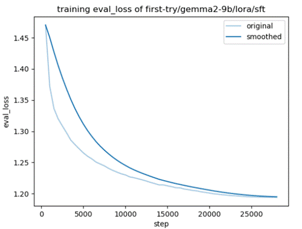
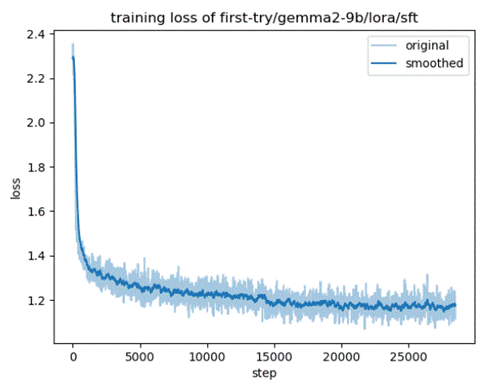
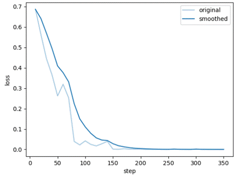
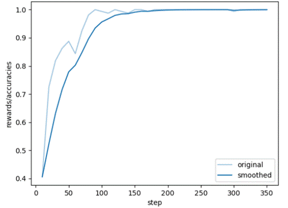

# Gemma2-9b-chinese-instruct with SFT and DPO

## 项目简介

Gemma 2系列模型是谷歌于2024年6月27日发布的开源大模型，其中Gemma 2-9B的性能在同类产品中处于领先地位，超过了Llama 3 8B和其他同规模的开源模型。Gemma 2-9B-Instruct模型，凭借其庞大的参数规模、卓越的自然语言理解能力以及灵活的指令执行能力，在全球范围内备受瞩目并赢得了高度评价。该模型在广泛的自然语言处理任务中，如文本创作、智能问答、信息摘要等，均展现出了非凡的性能，为人工智能技术的创新与应用奠定了坚实的基础。

本项目基于Gemma2-9B-Instruct 模型的强大基础，在llama-factory的训练框架下，精心挑选了百万条高质量的医疗与通用混合中英文数据集进行微调。为了进一步提升模型的表现能力，本项目还引入了直接偏好优化（Direct Preference Optimization, DPO）。

 

#### 模型特点

基础模型：基于开源的gemma2-9b-instruct，这是一个经过指令微调的大型语言模型。 

医疗+中文优化：利用丰富的医疗领域及中文数据集进行微调，显著提升模型在医疗场景及中文处理上的性能。

 DPO训练：进一步提升语言模型在特定任务或场景下的输出质量，使其更加符合人类的偏好或需求。

 

## 安装与加载

克隆本项目到本地：

git clone 

 

## 模型测评：

C-Eval：C-Eval 是一个全面的中文基础模型评估套件。它包含了大量的多项选择题，涵盖了人文、社科、理工以及其他专业四个大方向，包括52个不同的学科和四个难度级别。

| C-Eval(0-shot) | Average | Average(hard) | STEM | Social Sciences | Humanities | Other |
| -------------- | ------- | ------------- | ---- | --------------- | ---------- | ----- |
| 原模型         | 29.4    | 22.1          | 27.8 | 29.6            | 31.7       | 29.5  |
| 训练后         | 55.1    | 43            | 53.5 | 64.3            | 50.8       | 53.8  |

 

CMMLU：CMMLU是一个综合性的中文评估基准，专门用于评估语言模型在中文语境下的知识和推理能力。CMMLU涵盖了从基础学科到高级专业水平的67个主题。它包括：需要计算和推理的自然科学，需要知识的人文科学和社会科学,以及需要生活常识的中国驾驶规则等。

| CMMLU(0-shot) | Average | STEM  | Social Sciences | Humanities | Other |
| ------------- | ------- | ----- | --------------- | ---------- | ----- |
| 原模型        | 31.88   | 30.34 | 31.74           | 30.49      | 34.57 |
| 训练后        | 58.45   | 51.68 | 60.51           | 57.89      | 62.23 |

 

 

## 数据集

微调数据集：

|                         |                                                              |
| ----------------------- | ------------------------------------------------------------ |
| 中文微调数据集          | https://modelscope.cn/datasets/zhuangxialie/Llama3-Chinese-Dataset/files |
| code                    | https://huggingface.co/datasets/iamtarun/python_code_instructions_18k_alpaca |
| mathglm                 | https://cloud.tsinghua.edu.cn/d/8d9ee3e52bb54afd9c16/        |
| sft-20k                 | https://github.com/CMKRG/QiZhenGPT/blob/main/data/train/sft-20k.json |
| llama_data              | https://github.com/SCIR-HI/Huatuo-Llama-Med-Chinese/tree/main/data |
| ChatMed_Consult_Dataset | https://huggingface.co/datasets/michaelwzhu/ChatMed_Consult_Dataset |
| ChatMed_TCM-v0.2        | https://huggingface.co/datasets/michaelwzhu/ShenNong_TCM_Dataset |
| smile-train             | https://github.com/qiuhuachuan/smile/tree/main/data          |

 

dpo数据集：

|                   |                                                            |
| ----------------- | ---------------------------------------------------------- |
| DPO-En-Zh-20k     | https://huggingface.co/datasets/hiyouga/DPO-En-Zh-20k      |
| orca_dpo_pairs    | https://huggingface.co/datasets/Intel/orca_dpo_pairs       |
| Chinese-dpo-pairs | https://huggingface.co/datasets/wenbopan/Chinese-dpo-pairs |

 

Sft图像：

Dpo：

Training loss:

Training rewards:

 

 

 
